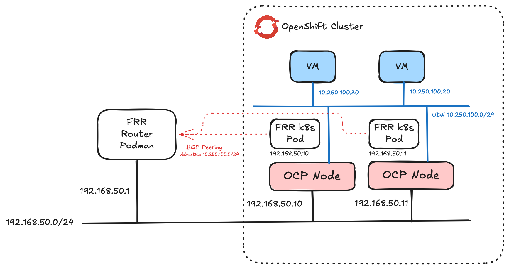

# OpenShift BGP lab

This repo contains some samples for setting up BGP and route advertisements for OCP with user defined networks. 


## Run frr container

Create daemons file with bgpd enabled and frr.conf. Examples in frr directory. Run container with these mapped to /etc/frr

```
podman run -d --privileged --name fr1 --volume  ~/etc/frr:/etc/frr --network=host frrouting/frr:latest
```

## Exec in container 

```
podman exec -it fr1 /bin/bash
```

## Checking configs

After exec into container. Run:

```
vtysh
```

Show neighbors:


```
show bgp neighbors
show bgp neighbors summary
```


Show routes:

```
show ip bgp
show ip route bgp
```

## manual configuration for reference

```
vtysh
conf t
router bgp 65000
neighbor 192.168.50.10 remote-as 65000
neighbor 192.168.50.11 remote-as 65000
neighbor 192.168.50.12 remote-as 65000
network 192.168.50.0/24
```

Write config

```
vtysh
conf t
write integrated
```


# OpenShift config

Enable routing capabilities in OVN-K

```
oc patch Network.operator.openshift.io cluster --type=merge -p='{"spec":{"additionalRoutingCapabilities": {"providers": ["FRR"]}, "defaultNetwork":{"ovnKubernetesConfig":{"routeAdvertisements":"Enabled"}}}}'
```

After a while check everything is deployed.

```
oc get frrconfiguration -A
oc get ra -A
oc get po -n openshift-frr-k8s
```

Example advertise default pod network:

```
oc apply -f advertise-default-network.yaml
```

Example advertise CUDN:

```
oc apply -f advertise-udn.yaml
```

## Firewall config

Ensure 179/tcp is enabled in the firewall to allow BGP peering.
