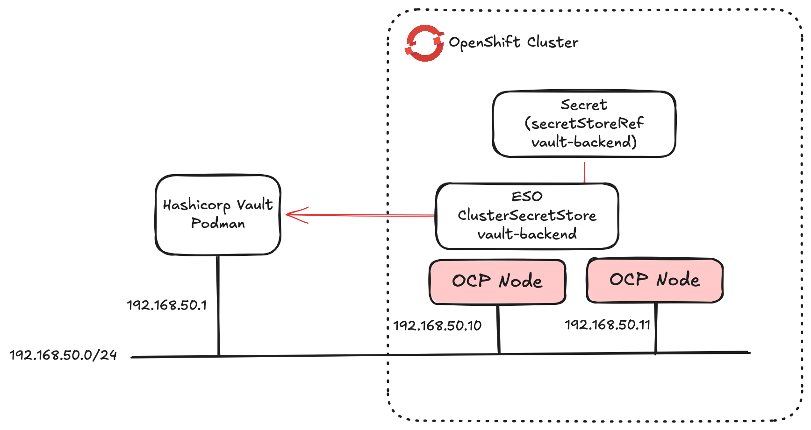

# External secrets management

This repo contains an example of using the External secrets management operator to retrieve secrets from Hashicorp Vault.


## Run vault container

This is a bit manual and needs automation.

Create vault directory

```
mkdir -p /vault/config/
chown -R 100:1000 /vault
```

Copy vault config from this repo into place

```
cp vault/local.json /vault/config/
```

Run vault:

```
podman run --name vault -v /vault:/vault:Z --cap-add=IPC_LOCK --privileged -d -p 8200:8200 hashicorp/vault server
```

Browse to vault on port 8200. You will need to do an initialisation and then unseal the vault. Save the vault config from the browser and keep it safe.

## Deploy eso operator

Install eso operator. 

## Configure network policy

External secrets operator puts tight controls around network policy. The example network policy allows http, https, dns and port 8200 for vault

```
oc apply -f eso-network-policy.yaml
```

## Create eso config

ExternalSecretsConfig instance is needed to actually deploy any external secret config. First create this:

```
oc apply -f eso-config.yaml
```

## Create secretstore

Configure access to vault. Populate the URL, path and token to access vault in eso-cluster-secret-store.yaml. The token should be encoded:


```
echo -n 'token' | base64
```

Apply the config.

```
oc apply -f eso-cluster-secret-store.yaml
```

Check the connectivity to vault:

```
oc get css
NAME            AGE    STATUS   CAPABILITIES   READY
vault-backend   109s   Valid    ReadWrite      True
```

You can validate network policy with this:


```
oc run network-test -n default --rm -i --tty --image=quay.io/curl/curl -- curl -I -s --connect-timeout 5 http://192.168.50.1:8200
```

## Create sample secret


```
oc apply -f external-secret.yaml
```

Validate the secret is synced:

```
oc get es
NAME            STORETYPE            STORE           REFRESH INTERVAL   STATUS         READY   LAST SYNC
vault-example   ClusterSecretStore   vault-backend   15s                SecretSynced   True    4s
```

```
oc extract secret/vault-secret-example --to=-
# foo
bar
```
