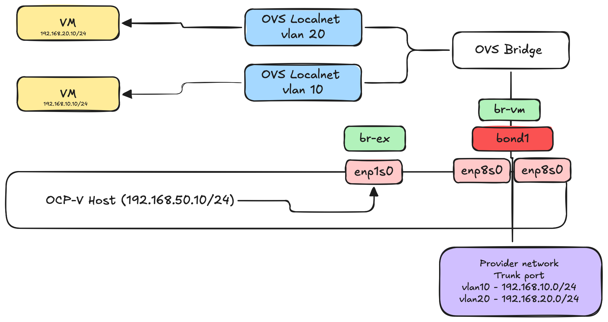

Network bond dedicated for VMs with vlans
=========

This example we uses two nics created into bond1. Ports are configured as  trunk ports and has a couple of vlans. We add ovs bridge called br-vm with nic enp8s0. We create two cudn for the different vlans.

