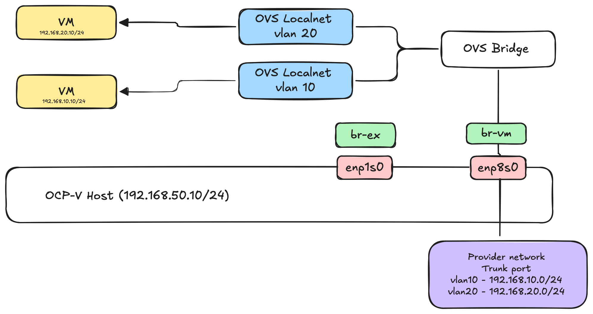

Dedicated nic with vlans
=========

This example we use a dedicated nic which is configured as a trunk port and has a couple of vlans. We add ovs bridge called br-vm with nic enp8s0. We create two cudn for the different vlans.

